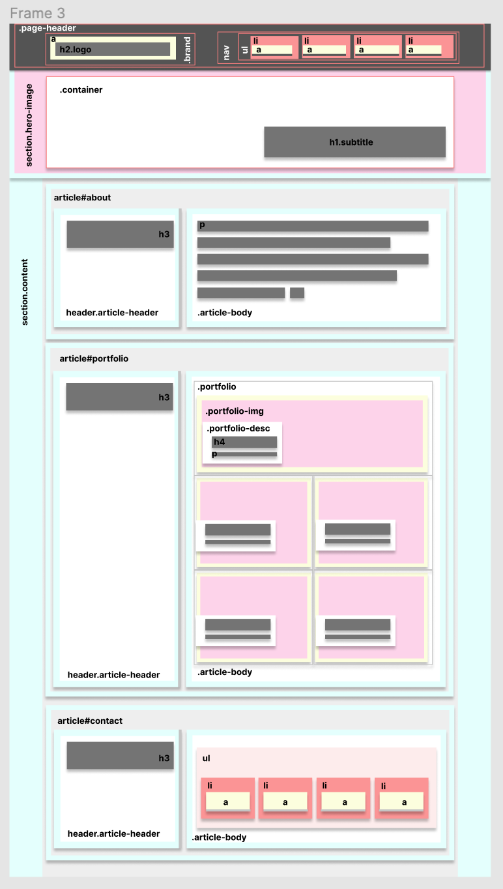
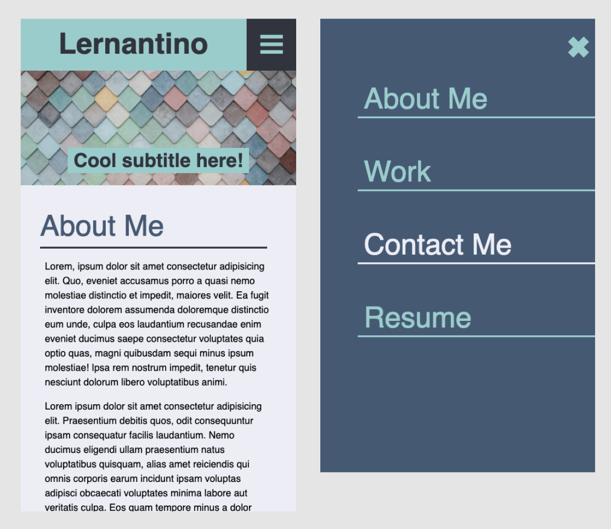

# UCSD Web Bootcamp - HW2
## Project: Professional Portfolio Webpage


### Developer's story
```
    One day, 
    A client shows up with a website mock up (in GIF),
    which he/she spent 💰💰💰💰💰💰💰💰💰 to hire a web designer animate it cool.
    The client asks if we (developers) can make their dream site come true 
    for 💵 (that's all they have left).

    Us (I, me and myself): 'Sure! Give us your Figma file and design assets'
    The client: 'What is Figma? This magic 🪄GIF🪄 is the vision, and the only file, that we have.'
    Us: 'How about the logo? Can you send us the logo file.'
    The client: 'Will the Word Doc work for you?"
    Us: 'NVM. Come back in a week for your site.' 

```
### The Awwward winning design in motion 🪄GIF🪄 


### The Process
**1. Simplify the design with wireframe**
- Screenshot the gif file and merge it together in 1 view
- Import the view to Figma to extract the exact design's colors
- Simplify the design by blocking out the content
- Build the wireframe with HTML structure in mind (containers within containers)
- Derive the wireframe in different views (desktop, tablet, mobile...)


**2. Build HTML structure and CSS**
- Since the wireframe (Frame 3) is done right, building HTML is an easy task
- Coding the HTML by looking at the wireframe. Peeling the design from big container to smaller container order
```
    <big container>
        <normalsize container>
            <small container>
                <smaller container>
                    some content
                </smaller container>

                <smaller container>
                    some content
                </smaller container>
            </small container>
        </normalsize container>
    </big container>
``` 

- The containers are added classes and id attributes as in frame 3 wireframe
- The labels on wireframe does not only help writing HTML but also CSS selector/targeting

- For the other media-query views, we just change the flex direction on flex container and flex-basis on flex items. 

- We include the 4th breakpoint at ~454px as bonus for client, which will hide the nav on mobile, and show it only if they click on the hamburger bar.



## Acceptance Criteria

```
GIVEN I need to sample a potential employee's previous work
✅ WHEN I load their portfolio
✅ THEN I am presented with the developer's name, a recent photo or avatar, and links to sections about them, ✅ their work, and how to contact them
✅ WHEN I click one of the links in the navigation
✅ THEN the UI scrolls to the corresponding section
✅ WHEN I click on the link to the section about their work
✅ THEN the UI scrolls to a section with titled images of the developer's applications
✅ WHEN I am presented with the developer's first application
✅ THEN that application's image should be larger in size than the others
✅ WHEN I click on the images of the applications
✅ THEN I am taken to that deployed application
✅ WHEN I resize the page or view the site on various screens and devices
✅ THEN I am presented with a responsive layout that adapts to my viewport
```
